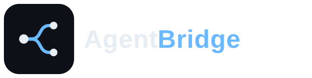

<p align="center">
  
</p>

<p align="center">
  <a href="LICENSE"></a>
  <a href="https://www.python.org/downloads/"></a>
</p>

<p align="center">
  <a href="#english">English</a> · <a href="#中文">中文</a>
</p>

## English

Agent Bridge is a connector for local coding agents. A coordinator — Codex, Cursor, or Kimi Code — directs Antigravity CLI, Grok Build, Kimi Code, DeepSeek Harness, and OpenCode. More agents will follow.

```text
User → Coordinator (Codex / Cursor / Kimi Code) → Agent Bridge (MCP) → Antigravity CLI
                                                                     → Grok Build
                                                                     → Kimi Code
                                                                     → DeepSeek Harness
                                                                     → OpenCode
```

It does not drive GUIs. The user talks only to the coordinator.

### Install

Need [uv](https://docs.astral.sh/uv/). Then:

```powershell
uv tool install git+https://github.com/FeiZhuLulu/Agent-Bridge.git
```

### Connect Codex

```powershell
codex mcp add agent_bridge -- %USERPROFILE%\.local\bin\agent-bridge.exe
```

Restart Codex. The coordinator skill is written the first time the server starts. More hosts and proxy notes: [SETUP.md](SETUP.md).

### Connect Cursor

`%USERPROFILE%\.cursor\mcp.json` (all projects) or `<repo>\.cursor\mcp.json`:

```json
{
  "mcpServers": {
    "agent-bridge": {
      "command": "C:/Users/YOU/.local/bin/agent-bridge.exe"
    }
  }
}
```

### Connect Kimi Code

`%USERPROFILE%\.kimi-code\mcp.json` (all projects) or `<repo>\.kimi-code\mcp.json`:

```json
{
  "mcpServers": {
    "agent-bridge": {
      "command": "C:/Users/YOU/.local/bin/agent-bridge.exe",
      "toolTimeoutMs": 600000
    }
  }
}
```

### Connect another agent

A plain ACP CLI needs no code. Add a block to `~/.agent-bridge/agents.toml`:

```toml
[agents.mycustom]
protocol = "acp"
command = ["mycustom-cli", "acp"]
revivable = true
```

Full process, including agents that need adapter changes: [skills/add-worker/SKILL.md](skills/add-worker/SKILL.md).

### Update

Close coordinators that are holding Bridge, then `agent-bridge upgrade`, then restart them.

### Tools

| Tool | Role |
| --- | --- |
| `list_agents` | Probe workers, report proxy/env + coordinator policy |
| `set_preferences` | Persist coordinator mode / routing preferences |
| `dispatch_task` | Start or resume a turn in the project `cwd` |
| `wait_task` | Block up to `timeout_sec` (default 180) |
| `check_task` | Non-blocking status |
| `get_result` | Truncated result + changed files |
| `get_transcript` | Paged session log |
| `cancel_task` | Cancel the in-flight turn |
| `list_sessions` | Known sessions |
| `end_session` | Shut down a worker process |

### Tests

```powershell
uv run pytest
```

## 中文

Agent Bridge 是一个联通各个本地 Agent 的连接器。由协调者——Codex、Cursor 或 Kimi Code——指挥 Antigravity CLI、Grok Build、Kimi Code、DeepSeek Harness、OpenCode 进行工作。后续将推出更多 Agent 支持。

```text
用户 → 协调者（Codex / Cursor / Kimi Code）→ Agent Bridge (MCP) → Antigravity CLI
                                                              → Grok Build
                                                              → Kimi Code
                                                              → DeepSeek Harness
                                                              → OpenCode
```

它不操作图形界面。用户只和协调者对话。

### 安装

先装 [uv](https://docs.astral.sh/uv/)，然后：

```powershell
uv tool install git+https://github.com/FeiZhuLulu/Agent-Bridge.git
```

### 接到 Codex

```powershell
codex mcp add agent_bridge -- %USERPROFILE%\.local\bin\agent-bridge.exe
```

重启 Codex。协调者 skill 会在服务器第一次启动时自动写入。其它宿主和代理见 [SETUP.md](SETUP.md)。

### 接到 Cursor

`%USERPROFILE%\.cursor\mcp.json`（所有项目）或 `<仓库>\.cursor\mcp.json`：

```json
{
  "mcpServers": {
    "agent-bridge": {
      "command": "C:/Users/YOU/.local/bin/agent-bridge.exe"
    }
  }
}
```

### 接到 Kimi Code

`%USERPROFILE%\.kimi-code\mcp.json`（所有项目）或 `<仓库>\.kimi-code\mcp.json`：

```json
{
  "mcpServers": {
    "agent-bridge": {
      "command": "C:/Users/YOU/.local/bin/agent-bridge.exe",
      "toolTimeoutMs": 600000
    }
  }
}
```

### 接入其它 Agent

普通 ACP CLI 不用改代码，在 `~/.agent-bridge/agents.toml` 加一段：

```toml
[agents.mycustom]
protocol = "acp"
command = ["mycustom-cli", "acp"]
revivable = true
```

完整流程（含需要改适配器的情况）见 [skills/add-worker/SKILL.md](skills/add-worker/SKILL.md)。

### 更新

先关掉正连着 Bridge 的协调者，执行 `agent-bridge upgrade`，再重启。

### 工具

| 工具 | 作用 |
| --- | --- |
| `list_agents` | 探测 worker，报告代理 / 环境 + 协调者策略 |
| `set_preferences` | 持久化协调者模式 / 路由偏好 |
| `dispatch_task` | 在项目 `cwd` 里开始或续上一次回合 |
| `wait_task` | 最多等待 `timeout_sec`（默认 180） |
| `check_task` | 非阻塞状态查询 |
| `get_result` | 截断后的结果 + 改过的文件 |
| `get_transcript` | 分页会话日志 |
| `cancel_task` | 取消进行中的回合 |
| `list_sessions` | 已知会话 |
| `end_session` | 关掉 worker 进程 |

### 测试

```powershell
uv run pytest
```

## License

[MIT](LICENSE) © FeiZhuLulu
